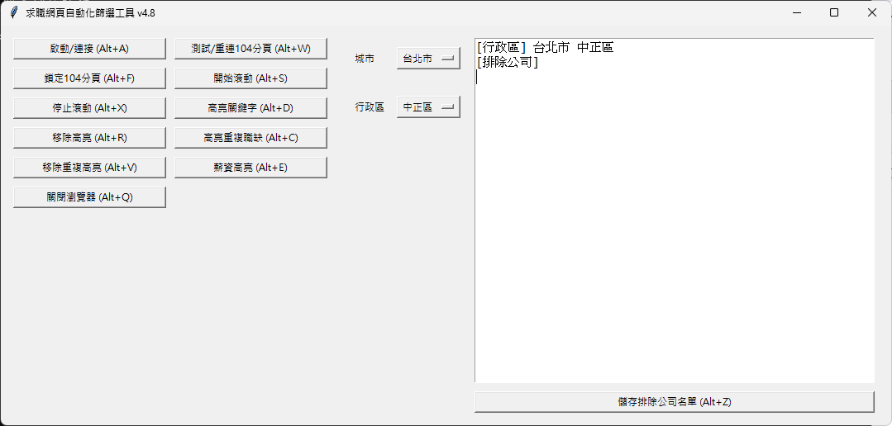

# JobWebFilterTool

## 專案簡介

本工具為 104 求職網頁自動化篩選與高亮輔助工具，基於 Python + Selenium + Tkinter 製作，支援自動瀏覽、薪資/關鍵字高亮、重複詞標記等功能，協助求職者更高效瀏覽職缺資訊。

## 主要功能
- 一鍵啟動獨立 Chrome 瀏覽器，保留登入狀態
- 自動滾動頁面
- 關鍵字高亮/移除
- 薪資條件高亮
- 頁面重複詞標記
- 分頁切換
- 一鍵關閉瀏覽器

## 功能特色
- 支援多分頁自動切換與偵測
- 不會因分頁關閉自動重啟，手動開新分頁即可繼續操作
- 完整中文介面，操作簡單
- 可自訂高亮關鍵字、薪資條件
- 支援重複詞自動標記，方便辨識常見用語

## 程式預覽圖
  
_▲ 程式主畫面：可控制求職網站篩選功能_

## 常見問題 (FAQ)
### Q: 為什麼點擊「測試連接」會顯示找不到分頁？
A: 代表所有分頁都被關閉，請手動在瀏覽器開新分頁後再點擊「測試連接」。

### Q: 可以同時開多個 Chrome 視窗嗎？
A: 建議只用本工具啟動的 Chrome 操作，避免 session 混淆。

### Q: 如何貢獻或回報問題？
A: 請於 github 專案頁面開 issue 或 pull request。

## 安裝與執行方式
1. 安裝 Python 3.8 以上
2. 安裝依賴套件：
   ```bash
   pip install selenium psutil markupsafe jieba
   ```
3. 下載對應版本的 chromedriver，並放置於 `chromedriver-win64` 資料夾
4. 執行主程式：
   ```bash
   python JobWebFilterTool.py
   ```

## 依賴套件
- selenium
- psutil
- markupsafe
- jieba
- tkinter（Python 內建）

## 目錄結構
```
JobWebFilterTool/
├── JobWebFilterTool.py      # 主程式
├── README.md               # 專案說明
├── requirements.txt        # 依賴套件清單
├── chromedriver-win64/     # chromedriver 執行檔
```
