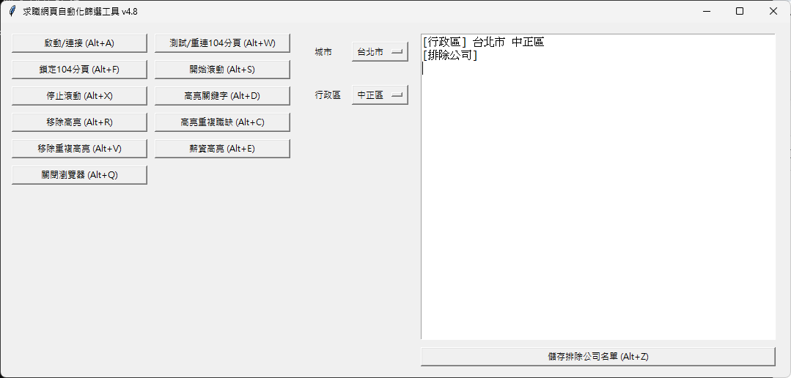

# JobWebFilterTool

## 專案簡介

JobWebFilterTool 是一款專為台灣 104 求職網站設計的桌面輔助工具，整合 Python、Selenium 與 Tkinter，支援自動瀏覽職缺、薪資與關鍵字高亮、重複職缺偵測與標記等功能，幫助使用者更高效過濾職缺、提升閱讀體驗。

本工具為獨立 GUI 應用程式，無需瀏覽器擴充插件，啟動後即擁有自動化與自定義篩選功能。

---

## v4.8 更新重點

- ✅ **重構重複職缺高亮邏輯**：移至 JavaScript，支援 iframe 與 Shadow DOM。
- ✅ **高亮功能模組化**：薪資、關鍵字與重複職缺皆使用 `execute_recursive_script` 統一框架，提升穩定性。
- ✅ **視覺優化**：重複職缺將以灰底虛線框＋滑鼠懸停提示顯示。
- ✅ **效能提升**：大幅優化重複職缺標記邏輯，提升準確度與速度。
- ✅ **快捷鍵支援**：新增 Alt+C (高亮重複職缺)、Alt+V (移除重複高亮) 等全域熱鍵。

---

## 功能一覽

- ✅ 一鍵啟動獨立 Chrome 瀏覽器（保留登入狀態）
- ✅ 自動捲動頁面，支援 iframe 結構
- ✅ 關鍵字高亮／移除（含公司名稱匯入）
- ✅ **薪資條件高亮**：支援月薪 / 年薪 / 面議條件
- ✅ **重複職缺偵測與標記**（v4.8 全面重構）
- ✅ 多分頁自動切換與偵測
- ✅ 可依據行政區儲存排除公司清單
- ✅ 一鍵關閉本工具啟動的 Chrome 瀏覽器

---

## 程式預覽圖

  
_▲ 主介面與功能選單_

---

## 常見問題 (FAQ)

### Q: 點選「測試連接」顯示找不到分頁？
A: 請先在新啟動的瀏覽器中手動打開 104 求職網頁，再點選「測試連接」。

### Q: 可以同時開多個 Chrome 瀏覽器嗎？
A: 建議僅操作由本工具啟動的 Chrome，避免 session 混淆。

### Q: 為什麼高亮功能沒反應？
A: 請確認 `mark.min.js` 檔案存在於主程式資料夾中，並命名為 `mark.min.js`。

---

## 安裝與使用說明

### 安裝 Python（版本 3.8 以上）

請前往 [Python 官方網站](https://www.python.org/downloads/) 安裝。

---

### 安裝必要 Python 套件

請於終端機執行以下指令：

```bash
pip install --upgrade selenium psutil markupsafe jieba keyboard
   ```
3. 下載對應版本的 chromedriver，並放置於 `chromedriver-win64` 資料夾
   請依照你本機的 Google Chrome 版本，下載對應版本的 ChromeDriver：

ChromeDriver 官方下載頁
 ```bash
[https://googlechromelabs.github.io/chrome-for-testing/](https://googlechromelabs.github.io/chrome-for-testing/)
```

範例下載方式 假設你目前的 Chrome 版本為 138.0.7204.101，系統為 Windows x64，請前往：
```bash
[https://storage.googleapis.com/chrome-for-testing-public/138.0.7204.101/win64/chromedriver-win64.zip](https://storage.googleapis.com/chrome-for-testing-public/138.0.7204.101/win64/chromedriver-win64.zip)
```
下載後解壓縮至本工具的 chromedriver-win64/ 子資料夾中。

4. 執行主程式：
   ```bash
   python JobWebFilterTool.py
   ```

## 依賴套件
- selenium 控制 Chrome 自動化
- psutil 系統資源管理
- markupsafe 處理 HTML 輸出安全性
- jieba 中文斷詞
- keyboard 註冊全域熱鍵
- tkinter GUI 視窗（內建）

## 目錄結構
```
JobWebFilterTool/
├── JobWebFilterTool.py        # 主程式（GUI）
├── README.md                  # 專案說明文件
├── mark.min.js                # 關鍵字標記函式庫（需手動放入）
├── chromedriver-win64/       # ChromeDriver 執行檔資料夾
├── taiwan_districts.json     # 台灣城市/行政區定義
├── company_filters.json      # 排除公司儲存設定
└── images/
    └── screenshot.png         # 程式預覽圖
```
